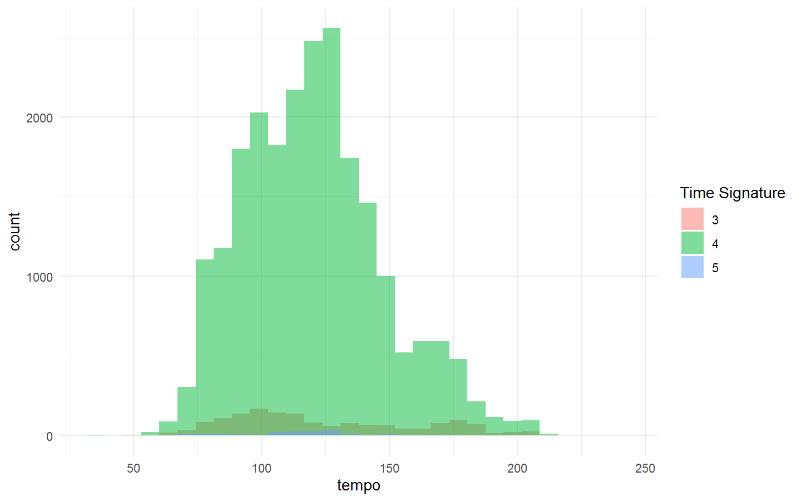
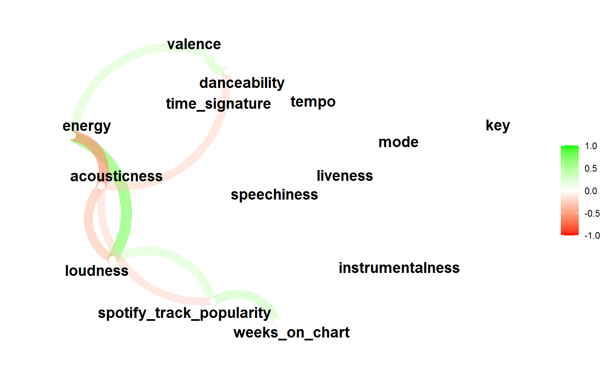
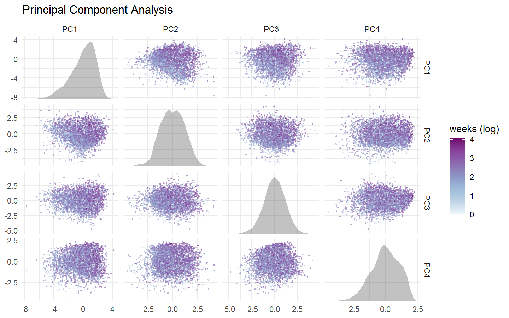
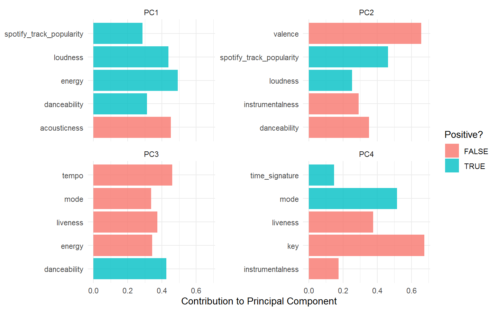
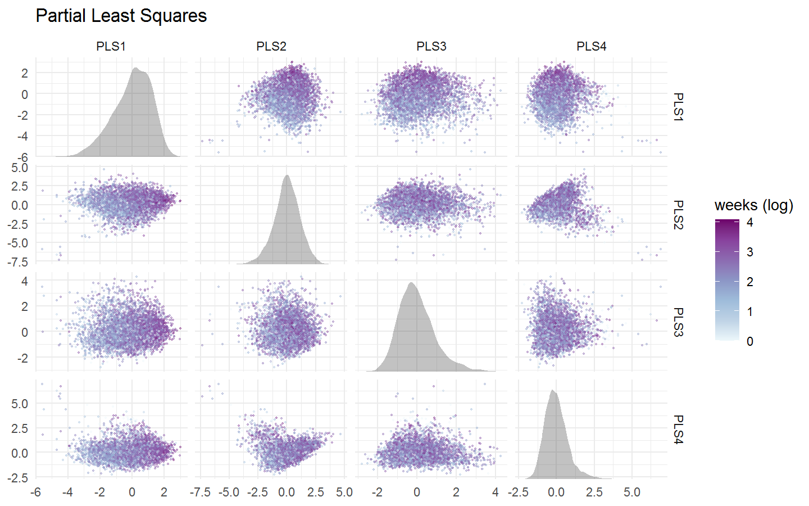
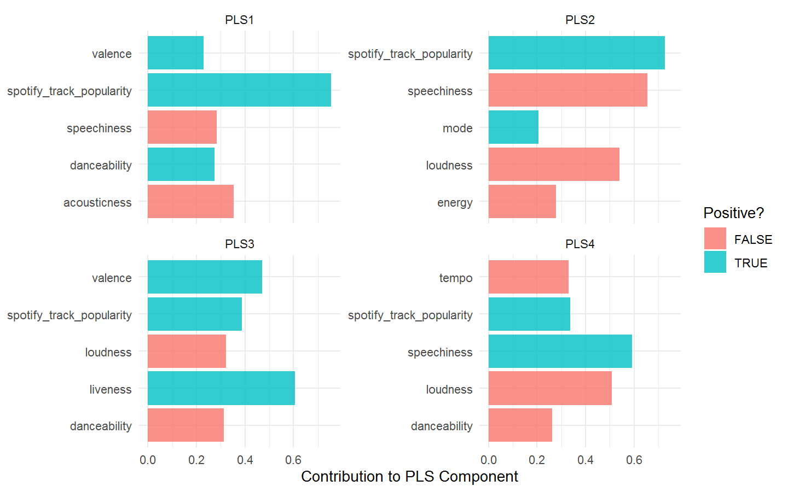

Billboard Top 100
================

Let’s use dimensionality reduction on the Billboard Top 100 songs
connecting data about where the songs were in the rankings with mostly
audio features available from Spotify. We will see which features are
important in keeping the songs for the most time on the Top100 charts.
The features are taken from Spotify (in the audio\_features.csv file).

## Exploring the Data

``` r
library(tidyverse)

# billboard ranking 
billboard <- readr::read_csv("data/billboard.csv")

# audio features data
audio_features <- readr::read_csv("data/audio_features.csv")
```

``` r
# finding how long each song was on the charts
max_weeks <- 
    billboard %>%
    group_by(song_id) %>% 
    summarise(weeks_on_chart = max(weeks_on_chart))
```

``` r
# joining the audio features with the max_weeks
billboard_joined <- 
    audio_features %>% 
    filter(!is.na(danceability)) %>% 
    inner_join(max_weeks)
```

``` r
# plotting distribution of tempo with time signature
billboard_joined %>% 
    filter(tempo > 0, time_signature > 1) %>% 
    ggplot(aes(tempo, fill = factor(time_signature))) + 
    geom_histogram(alpha = 0.5, position = "identity") + 
    labs(fill = "Time Signature")
```

<!-- -->

``` r
# correlation plot between other audio features:
library(corrr)

billboard_joined %>% 
    select(danceability:weeks_on_chart) %>% 
    na.omit() %>% 
    correlate() %>% 
    rearrange() %>% 
    network_plot(colors = c("red", "white", "green"))
```

<!-- -->

``` r
# having a look at the weeks_on_chart feature:
summary(billboard_joined$weeks_on_chart)
```

    ##    Min. 1st Qu.  Median    Mean 3rd Qu.    Max. 
    ##    1.00    5.00   10.00   11.78   17.00   87.00

## Dimensionality Reduction

``` r
library(tidymodels)

set.seed(42)
# splitting the features into train and test sets
billboard_split <- 
    billboard_joined %>% 
    select(danceability:weeks_on_chart) %>% 
    na.omit() %>% 
    mutate(weeks_on_chart = log(weeks_on_chart)) %>% 
    initial_split(strata = weeks_on_chart)

billboard_split
```

    ## <Analysis/Assess/Total>
    ## <18245/6084/24329>

``` r
# getting the training and testing sets:
billboard_train <- training(billboard_split)
billboard_test <- testing(billboard_split)
```

##### A Basic Starter Recipe:

``` r
# creating the recipe
billboard_rec <- 
    recipe(weeks_on_chart ~ ., data = billboard_train) %>%
    # removes all zero variance predictors
    step_zv(all_numeric_predictors()) %>% 
    # normalizing all the predictors 
    step_normalize(all_numeric_predictors())

billboard_rec
```

    ## Recipe
    ## 
    ## Inputs:
    ## 
    ##       role #variables
    ##    outcome          1
    ##  predictor         13
    ## 
    ## Operations:
    ## 
    ## Zero variance filter on all_numeric_predictors()
    ## Centering and scaling for all_numeric_predictors()

``` r
# preparing the recipe after creating it
rec_trained <- prep(billboard_rec)
rec_trained
```

    ## Recipe
    ## 
    ## Inputs:
    ## 
    ##       role #variables
    ##    outcome          1
    ##  predictor         13
    ## 
    ## Training data contained 18245 data points and no missing data.
    ## 
    ## Operations:
    ## 
    ## Zero variance filter removed no terms [trained]
    ## Centering and scaling for danceability, energy, key, loudness, mode, spee... [trained]

    Creating a helper function to prep() and bake() the recipe and to make a visualization of the results:

``` r
# creating the helper function
library(ggforce)

plot_test_results <- function(recipe, dat = billboard_test) {
    recipe %>% 
        prep() %>% 
        bake(new_data = dat) %>% 
        ggplot() + 
        geom_autopoint(aes(color = weeks_on_chart), alpha = 0.4, size = 0.5) + 
        geom_autodensity(alpha = 0.3) + 
        facet_matrix(vars(-weeks_on_chart), layer.diag = 2) + 
        scale_color_distiller(palette = "BuPu", direction = 1) + 
        labs(color = "weeks (log)")
}
```

### PCA - Principal Component Analysis

``` r
# adding PCA to the base recipe and calling the helper function we created

rec_trained %>%
    step_pca(all_numeric_predictors(), num_comp = 4) %>% 
    plot_test_results() + 
    ggtitle("Principal Component Analysis")
```

<!-- -->

`tidy()` the recipe to find features that contribute the most to the
Principal Components:

``` r
rec_trained %>% 
    step_pca(all_numeric_predictors(), num_comp = 4) %>% 
    prep() %>% 
    tidy(number = 3) %>% 
    # getting the only the first 4 PC
    filter(component %in% c("PC1", "PC2", "PC3", "PC4")) %>% 
    # grouping by PC
    group_by(component) %>% 
    # getting the top 5 by absolute value
    slice_max(abs(value), n = 5) %>% 
    ungroup() %>% 
    ggplot(aes(abs(value), terms, fill = value > 0)) + 
    geom_col(alpha = 0.8) + 
    facet_wrap(vars(component), scales = "free_y") + 
    labs(x = "Contribution to Principal Component", y = NULL, fill = "Positive?")
```

<!-- -->

    - The First Component PC1 as we see is all about the Loudness, Energy and danceability of the Songs.
    - whereas the Second Component PC2 is about valence, where high valence means more positive, happy and cheerful songs, but here we see negative correlation between with valence.

### PLS - Partial Least Squares

``` r
rec_trained %>% 
    step_pls(all_numeric_predictors(), outcome = "weeks_on_chart", num_comp = 4) %>%
    plot_test_results() +
    ggtitle("Partial Least Squares")
```

<!-- -->

``` r
rec_trained %>% 
    step_pls(all_numeric_predictors(), outcome = "weeks_on_chart", num_comp = 4) %>%
    prep() %>% 
    tidy(number = 3) %>% 
    filter(component %in% c("PLS1", "PLS2", "PLS3", "PLS4")) %>% 
    group_by(component) %>% 
    slice_max(abs(value), n = 5) %>% 
    ungroup() %>% 
    ggplot(aes(abs(value), terms, fill = value > 0)) + 
    geom_col(alpha = 0.8) + 
    facet_wrap(vars(component), scales = "free_y") + 
    labs(x = "Contribution to PLS Component", y = NULL, fill = "Positive?")
```

<!-- -->

    - The First PLS Component PLS1 - shows high correlation between popularity.
    - The Second PLS Component PLS2 - shows high positive correlation with popularity and a negative correlation with the speechiness and the loudness of the song.
